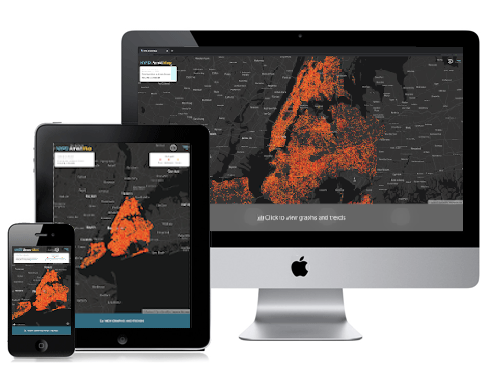

[![MIT License][license-shield]][license-url]
[![LinkedIn][linkedin-shield]][linkedin-url]


<!-- PROJECT LOGO -->
<br />
<p align="center">
  <a href="https://github.com/amamenko/nypd-arrest-map">
    
  </a>

  <h3 align="center">NYPD Arrest Map</h3>

  <p align="center">
    Data visualization and analysis tool for year-to-date NYPD arrests 
    <br />
    <br />
    <a href="https://nypd-arrest-map.herokuapp.com">View Demo</a>
    ·
    <a href="https://www.youtube.com/watch?v=eO54xtfrfPk">Watch Video Explanation</a>
    ·
    <a href="https://github.com/amamenko/nypd-arrest-map/issues">Report Issue</a> 
  </p>
</p>


## Introduction

The New York Police Department (NYPD) publishes data that reflect every arrest that takes place in New York City (NYC) during the current year. This dataset is manually extracted
and updated on a quarterly basis by the Office of Management Analysis and Planning on [NYC Open Data's NYPD Arrest Data (Year to Date)](https://data.cityofnewyork.us/Public-Safety/NYPD-Arrest-Data-Year-to-Date-/uip8-fykc) website.
On this website, the NYPD states that "this data can be used by the public to explore the nature of police enforcement activity."

Every arrest that is published includes an approximate location and date, as well as demographical information about the arrestee. Other details about the nature of the arrest, 
such as whether a felony, misdemeanor, or violation has taken place, are also included.

Please note that occasionally, arrests in the NYPD datasets will be erroneously attributed to one borough, while having the longitude and latitude of another. These have been corrected in the NYPD Arrest Map in
favor of the arrest's geocoordinates.


## About the Map

<p align="center">
<a href="https://nypd-arrest-map.herokuapp.com">
    
</a>
</span>
<br/ >
<br />


The NYPD Arrest Map is an application built with the React library (using Redux for state management) as well as the Express framework for Node.js. The majority of the functionality of the
website can be broken down as follows:

<strong>Server-side</strong>
* Scrapes the [NYC Open Data's NYPD Arrest Data (Year to Date)](https://data.cityofnewyork.us/Public-Safety/NYPD-Arrest-Data-Year-to-Date-/uip8-fykc) page
daily using [Puppeteer](https://github.com/puppeteer/puppeteer) and [node-cron](https://www.npmjs.com/package/node-cron).
* Parses and formats the dataset if any updates are detected.
* Gzip-compresses and uploads the JSON dataset to a [Google Cloud Storage](https://cloud.google.com/storage) (GCS) bucket.
* Upon request, uses [Oboe.js](http://oboejs.com) to stream the latest JSON data from GCS to the client in chunks by means of the [WebSocket API](https://developer.mozilla.org/en-US/docs/Web/API/WebSockets_API).

<strong>Client-side</strong>
* Compiles received dataset chunks and performs analyses/formatting in background threads using [Web Workers](https://developer.mozilla.org/en-US/docs/Web/API/Web_Workers_API).
* Serves map assets and geomarkers using [deck.gl](https://deck.gl) and [Mapbox](https://www.mapbox.com).
* Mounts [carousel](https://www.npmjs.com/package/react-alice-carousel) (only upon request, due to memory allocation issues) showing [Google Charts](https://www.npmjs.com/package/react-google-charts) of various natures (pie charts, bar charts, line charts) based on current filtered data.
* When prompted, filters currently shown arrest geomarkers and graph data in background thread.

## Local Development

To set up this project locally, you can follow the steps below.

### Prerequisites

You will need to have the following software installed:
* npm
* Git
* Node.js

### Installation

1. Get a free Mapbox API token at [https://www.mapbox.com](https://www.mapbox.com).
2. Create a new [Google Cloud Storage](https://cloud.google.com/storage) project in the Cloud Console.
3. Create a new service account key JSON file.
4. Clone the Github repository.
   ```sh
   git clone https://github.com/amamenko/nypd-arrest-map.git
   ```
5. Install all NPM packages.
   ```sh
   npm install
   ```
6. Webpack will throw a `Conflict: Multiple assets emit to the same filename` warning due to web workers creating multiple background threads and not emitting to dynamic
filenames. Edit the `webpack.config.js` file, specifically the `output` key - concerning the build folder - of the returned object with the following values:

  ```JS
      filename: isEnvProduction
            ? 'static/js/[name].[contenthash:8].js'
            : isEnvDevelopment && '[name].bundle.js'
  ``` 
    
  ```JS
      chunkFilename: isEnvProduction
            ? 'static/js/[name].[contenthash:8].chunk.js'
            : isEnvDevelopment && 'static/js/[name].chunk.js'
```  
   
7. Enter your Mapbox API token as a client-side environment variable.
   ```JS
   REACT_APP_MAPBOX_TOKEN=YOUR MAPBOX TOKEN
   ```
8. Enter your Google Cloud Storage JSON information as server-side environment variables.
   ```JS
   PROJECT_ID=YOUR PROJECT ID
   PRIVATE_KEY_ID=YOUR PRIVATE KEY ID
   PRIVATE_KEY=YOUR PRIVATE KEY
   CLIENT_EMAIL=YOUR CLIENT EMAIL
   CLIENT_ID=YOUR CLIENT ID
   AUTH_URI=YOUR AUTH URI
   TOKEN_URI=YOUR TOKEN URI
   PROVIDER_CERT_URL=YOUR PROVIDER CERT URL
   CLIENT_CERT_URL=YOUR CLIENT CERT URL
   ```
9. Build for production.
   ```JS
   npm run build
   ```
   
## Known Issue
iPhone 11 phones running iOS 14.1 have been found to experience "zoom breathing" when geomarkers are selected. The scatterplot layer will scale and zoom in for a moment before resetting itself.
[I have opened an issue with deck.gl regarding this](https://github.com/visgl/deck.gl/issues/5140) and, although the bug is still open, the issue is otherwise fixed in iOS 14.2.
   
<!-- CONTRIBUTING -->
## Contributing

Contributions are welcome!

1. Fork the Project
2. Create your Feature Branch (`git checkout -b feature/MyFeature`)
3. Commit your Changes (`git commit -m 'Add my feature'`)
4. Push to the Branch (`git push origin feature/MyFeature`)
5. Open a Pull Request


<!-- LICENSE -->
## License

Distributed under the MIT License. See `LICENSE.txt` for more information.


<!-- CONTACT -->
## Contact

Avraham (Avi) Mamenko - avimamenko@gmail.com

Project Link: [https://github.com/amamenko/nypd-arrest-map](https://github.com/amamenko/nypd-arrest-map)


<!-- ACKNOWLEDGEMENTS -->
## Acknowledgements
* [NYPD / NYC Open Data](https://opendata.cityofnewyork.us)
* [deck.gl](https://deck.gl)
* [Mapbox](https://www.mapbox.com)
* [Heroku](https://www.heroku.com)
* [React Icons](https://react-icons.github.io/react-icons)
* [React Alice Carousel](https://www.npmjs.com/package/react-alice-carousel)
* [React Google Charts](https://react-google-charts.com)
* [Tippy.js for React](https://www.npmjs.com/package/@tippyjs/react)
* [React Radio Buttons](https://www.npmjs.com/package/react-radio-buttons)
* [React Ladda](https://www.npmjs.com/package/react-ladda)
* [React Burger Menu](https://github.com/negomi/react-burger-menu)
* [ReactJS Popup](https://www.npmjs.com/package/reactjs-popup)
* [React Circular Progressbar](https://www.npmjs.com/package/react-circular-progressbar)
* [React Spinners](https://www.npmjs.com/package/react-spinners)
* [react-div-100vh](https://www.npmjs.com/package/react-div-100vh)
* [React Modal](https://www.npmjs.com/package/react-modal)
* [worker-loader](https://www.npmjs.com/package/worker-loader)
* [Oboe.js](http://oboejs.com)
* [Puppeteer](https://www.npmjs.com/package/puppeteer)
* [node-cron](https://www.npmjs.com/package/node-cron)
* [csvtojson](https://www.npmjs.com/package/csvtojson)
* [Google Cloud Storage](https://cloud.google.com/storage)
* [Day.js](https://github.com/iamkun/dayjs) 
* [express-sslify](https://www.npmjs.com/package/express-sslify)
* [Best-README-Template](https://github.com/othneildrew/Best-README-Template)


<!-- MARKDOWN LINKS & IMAGES -->
<!-- https://www.markdownguide.org/basic-syntax/#reference-style-links -->
[license-shield]: https://img.shields.io/github/license/othneildrew/Best-README-Template.svg?style=for-the-badge
[license-url]: https://github.com/amamenko/nypd-arrest-map/blob/master/LICENSE.txt
[linkedin-shield]: https://img.shields.io/badge/-LinkedIn-black.svg?style=for-the-badge&logo=linkedin&colorB=555
[linkedin-url]: https://www.linkedin.com/in/avrahammamenko

